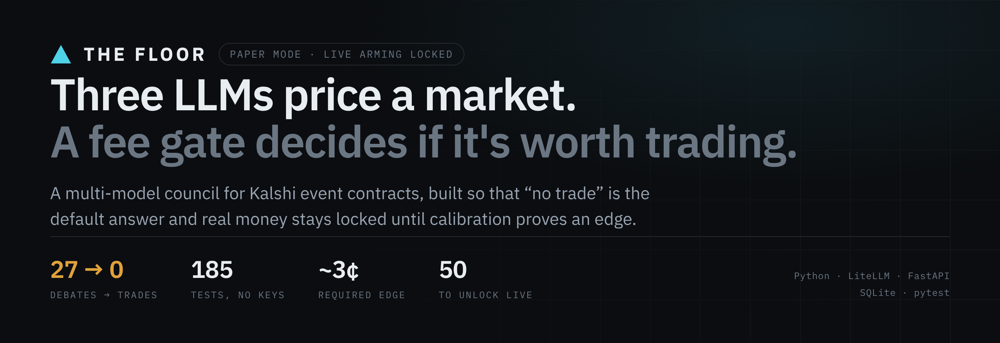
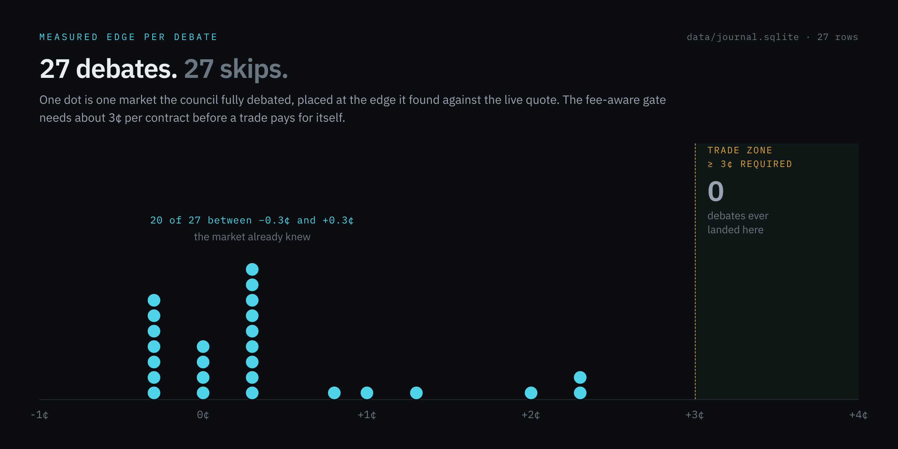
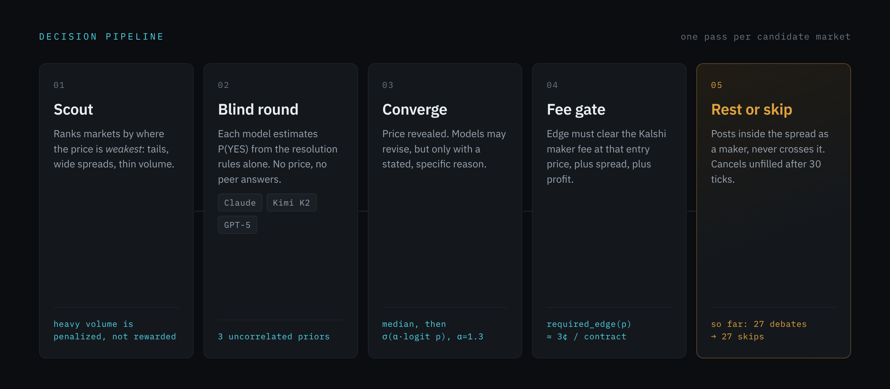
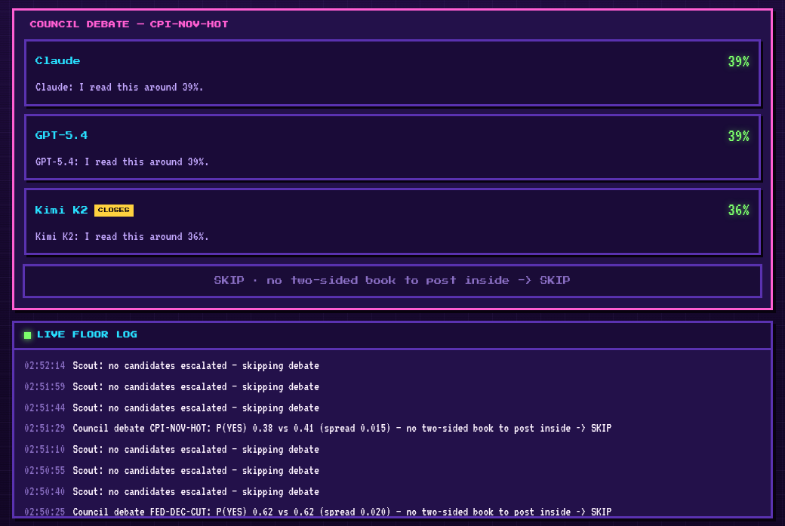

<p align="center">
  
</p>

<p align="center">
  <a href="https://github.com/debarshi13/kalshi-llm-council/actions/workflows/tests.yml"></a>
  
  
  
</p>

Three language models independently price a [Kalshi](https://kalshi.com) event contract, argue
toward a consensus probability, and hand it to a fee-aware gate that decides whether the edge is
worth trading. Usually it isn't, and the bot says so.

The interesting part isn't the models. It's everything built to stop them from losing money.

---

## What happened



**27 debates. 27 skips.** Every market the council fully deliberated came back with a
probability within about a cent of what Kalshi was already charging. Not one cleared the
threshold needed to cover fees.

That result is the product working, not failing. An earlier version of this bot had no fee
gate, and it is the reason the gate exists:

| | v1 (no fee gate) | current |
|---|---|---|
| Orders | Crossed the spread, taker fees both ways | Rest inside the spread, maker only |
| Prompt | Market price given as a "strong prior" | Round 1 never sees the price |
| Trades placed | 19 fills | 0 |
| Real P&L | **$27.31 → $17.86** | n/a (paper) |

v1 lost money in the most ordinary way available: it anchored three models to the market
price, let them answer in sequence so they could see each other, and then paid Kalshi a
taker fee on both sides of every "disagreement" they manufactured. The rebuild targets each
of those three failures directly.

Raw evidence is committed at [`data/journal.sqlite`](data/journal.sqlite) — every debate,
its blind and converged probabilities, the market price, the measured edge, and the reason
it was skipped.

---

## How it decides



**Scout** ranks candidate markets by where price is *weakest* — tails (3–20¢ and 80–97¢, where
fees are roughly 3× cheaper and favorite-longshot bias is documented), spreads wide enough to
post inside, and resolution within a week. Heavy volume is penalized, not rewarded: a
heavily traded market has already absorbed the sharps.

**Round 1 is blind.** Each model sees the title, the resolution rules, and research notes.
No market price, no peer answers. This exists because the previous version put the price in
the prompt as a prior and let models answer in order, which produced herding by construction.

**Round 2 converges.** The price and all round-1 estimates are revealed. Models may revise,
but only with a stated specific reason. The aggregate is the median of round-2 estimates,
then extremized in logit space — `p' = σ(α·logit(p))`, α default 1.3 — to counteract the
regression-to-the-mean that averaging induces.

**The fee gate** is where most candidates die:

```python
def required_edge(price, contracts=10, spread_buffer=0.01, min_profit=0.01):
    """Per-contract edge (dollars) a maker entry at `price` must clear."""
    return maker_fee(price, contracts) / max(contracts, 1) + spread_buffer + min_profit
```

Kalshi's fee is `ceil(0.07 · contracts · p · (1−p))`, so it peaks at 50¢ and falls toward the
tails. The gate computes the real fee at the real entry price rather than applying a flat
threshold, which works out to roughly 3¢ per contract near the middle of the book. Below
that, a correct prediction still loses money.

**Execution rests, never crosses.** Orders post inside the spread as maker orders (a quarter
of the taker fee) and cancel unfilled after 30 ticks. Positions are only booked on actual
`fill_count`.

---

## The calibration gate

Real-money execution is locked, and not by a config flag:

```python
def arm_execution(self) -> None:
    """Turn on REAL order placement."""
    rep = self.journal.calibration_report(min_n=min_n)

    if not rep["beats_market"]:
        raise RuntimeError(
            f"calibration gate: {rep['n']}/{min_n} resolved predictions, model Brier "
            f"{rep['brier_model']} vs market {rep['brier_market']} — edge not proven. "
            f"Keep paper-trading, or set COUNCIL_CALIBRATION_OVERRIDE=true to gamble anyway."
        )
```

Arming raises until the council's [Brier score](https://en.wikipedia.org/wiki/Brier_score)
beats the market-price baseline across 50 resolved predictions. P&L over a few weeks is too
noisy to distinguish skill from luck; calibration against the price you could have taken
instead is not. The override exists, is explicit, and logs loudly.

The gate was written before the strategy it gates.

---

## Run it

The full pipeline runs offline against deterministic mock data. **No API keys, no account,
no money.**

```bash
python -m venv .venv && source .venv/bin/activate
pip install -e ".[dev]"

pytest -q                    # 185 tests, all green without credentials
uvicorn council.api.app:app --port 8777
```

Open <http://127.0.0.1:8777> and watch the floor deliberate:



*Offline demo: mock market data and scripted model turns, exercising the real pipeline —
real journal writes, real risk checks, real approval gates.* Live models are an optional
extra (`pip install -e ".[real]"`) and route through LiteLLM, so swapping a hosted model
for a self-hosted endpoint is a config change.

---

## Risk controls

Every one of these is enforced in code, not documentation.

| Control | Default | Where |
|---|---|---|
| Max position | $5 | `RiskGuard.max_position_usd` |
| Max total exposure | $50 | `RiskGuard.max_total_exposure_usd` |
| Daily loss halt | $20 | `RiskGuard.max_daily_loss_usd` |
| Trades per day | 20 | `FloorState.MAX_TRADES_PER_DAY` |
| Live arming | Brier-gated | `arm_execution()` |
| Order placement | Human approval | `COUNCIL_REQUIRE_APPROVAL` |
| Session model spend | 300 calls | `FloorState.MAX_LIVE_CALLS` |
| Kill switch | Freeze + cancel resting orders | `FloorState.frozen` (`POST /api/floor/stop`) |

A frozen floor proactively cancels resting real orders rather than waiting for TTL, and a
cancel that fails after a partial fill is retried rather than dropped.

---

## Layout

```
src/council/
├── trading/
│   ├── scout.py         market selection — structural edge scoring
│   ├── deliberation.py  two-round council, median + logit extremization
│   ├── selection.py     edge_score, maker pricing
│   ├── ledger.py        Kalshi fee model, required_edge
│   ├── risk.py          position/exposure/loss caps
│   ├── execution.py     RSA-signed Kalshi client, maker orders
│   ├── journal.py       SQLite journal + calibration report
│   ├── exits.py         pure exit core — take-profit, edge decay, optional stop
│   └── floor.py         the live loop the dashboard polls
├── api/app.py           FastAPI + SSE
└── models.py            LiteLLM routing
web/floor-game.html      the dashboard
```

`MockCouncil`, `MockScout`, and `MockMarketData` run the *real* control flow with scripted
turns, which is why the suite is fast and needs no credentials.

---

## Design docs

Each feature was specced before it was built:

| Spec | What it decided |
|---|---|
| [Trading harness](docs/trading-design.md) | Paper-first architecture, three strategy books, scoring |
| [Deliberative council](docs/superpowers/specs/2026-06-20-deliberative-council-trading-design.md) | Roundtable structure and consensus rules |
| [Scout funnel](docs/superpowers/specs/2026-06-21-scout-funnel-design.md) | Cheap structural filter ahead of expensive debate |
| [Exit layer](docs/superpowers/specs/2026-06-23-exit-layer-design.md) | Take-profit, edge decay, optional stop-loss |
| [Blend, don't beat](docs/superpowers/specs/2026-07-04-blend-dont-beat-design.md) | The v1 post-mortem and this rebuild |

---

## Honest status

Paper mode. No proven edge. The calibration gate has 27 of the 50 resolved predictions it
needs, and nothing says the remaining 23 will unlock it — directional LLM-vs-price trading
on liquid markets is structurally negative-EV, which the journal agrees with so far.

What this repo demonstrates is the machinery for finding that out without losing money doing it.

## License

MIT — see [LICENSE](LICENSE).
